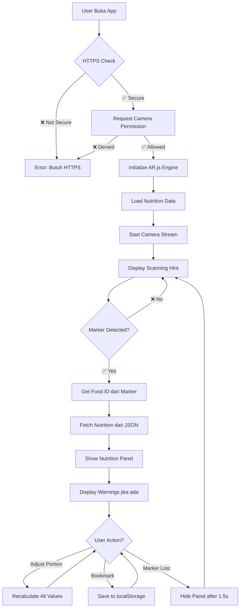

# 🍔 NutriScan AR - Pemindai Gizi Makanan Cepat Saji

[](https://nutriscanid.vercel.app)
[](https://ar-js-org.github.io/AR.js-Docs/)
[](LICENSE)

> **Web AR Application** untuk memindai marker makanan dan menampilkan informasi gizi secara real-time menggunakan Augmented Reality.


---

## 🎯 Fitur Utama

### ✅ 1. Deteksi Marker dengan AR

- ✨ Real-time marker detection menggunakan **AR.js**
- 📷 Camera otomatis aktif saat aplikasi dibuka
- 🎯 Multi-marker support: Burger, Kentang Goreng, Minuman, Ayam, Pizza
- 🔄 Tracking stabil dengan grace period anti-flicker

### ✅ 2. Data Gizi Lengkap

- 📊 **10 makanan cepat saji** dengan nutrisi lengkap
- 🔢 Data meliputi: Kalori, Protein, Lemak, Karbohidrat, Gula, Natrium
- 📱 Update real-time saat marker terdeteksi
- 💾 Data tersimpan dalam format JSON (offline-ready)

### ✅ 3. Overlay AR Interaktif

- 🎨 **Glassmorphism UI** modern dan elegan
- 📍 Overlay "menempel" pada marker secara virtual
- ⚡ Animasi smooth saat panel muncul/hilang
- 📲 Responsive di semua device (mobile-first)

### ✅ 4. Penyesuaian Porsi Real-Time

- 🎚️ **Slider porsi:** 0.5x → 2x (setengah hingga double)
- 🔄 Semua nutrisi dihitung ulang instant
- 💯 Contoh: 450 kcal → 900 kcal (porsi 2x)
- 📈 Visual feedback jelas saat slider bergerak

### ✅ 5. Sistem Peringatan Kesehatan

- ⚠️ **3 Kategori Warning:**
  - 🔴 **Kalori Tinggi** (> 600 kcal)
  - 🔴 **Natrium Tinggi** (> 800 mg)
  - 🩷 **Gula Tinggi** (> 20 g)
- 🎨 Color-coded badges untuk visibility
- 🔔 Update otomatis saat portion berubah
- 💡 Membantu user membuat keputusan lebih sehat

### ✅ 6. Fitur Bookmark

- 🔖 Simpan makanan favorit atau yang sering dikonsumsi
- 💾 Persistent storage menggunakan **localStorage**
- 📚 Modal "Item Tersimpan" untuk akses cepat
- ❌ Hapus bookmark kapan saja
- 📊 Tracking untuk analisis konsumsi (future)

---

## 🚀 Demo Live

**URL Production:** [nutriscanid.vercel.app](https://nutriscanid.vercel.app)

### Cara Testing:

1. Buka URL di smartphone (Chrome/Safari)
2. Izinkan akses kamera
3. Download & print marker:
   - **Hiro Marker** (Burger): [Download](https://raw.githubusercontent.com/AR-js-org/AR.js/master/data/images/hiro.png)
   - **Kanji Marker** (Kentang): [Download](https://raw.githubusercontent.com/AR-js-org/AR.js/master/data/images/kanji.png)
4. Arahkan kamera ke marker yang sudah di-print
5. Panel gizi akan muncul otomatis!

---

## 🛠️ Teknologi Stack

| Layer               | Technology           | Purpose                     |
| ------------------- | -------------------- | --------------------------- |
| **AR Engine**       | AR.js + A-Frame      | WebAR marker-based tracking |
| **Frontend**        | Vanilla JS (ES6+)    | Core application logic      |
| **Styling**         | CSS3 (Glassmorphism) | Modern UI/UX design         |
| **Storage**         | localStorage         | Bookmark persistence        |
| **Hosting**         | Vercel               | Static site hosting (HTTPS) |
| **Version Control** | Git + GitHub         | Source code management      |

---

## 📱 Browser Support

| Browser          | Version | Status                    |
| ---------------- | ------- | ------------------------- |
| Chrome (Android) | 90+     | ✅ Fully Supported        |
| Safari (iOS)     | 14+     | ✅ Fully Supported        |
| Samsung Internet | Latest  | ✅ Supported              |
| Firefox Mobile   | Latest  | ⚠️ Limited (experimental) |

**Requirements:**

- ✅ HTTPS (mandatory untuk camera access)
- ✅ getUserMedia API support
- ✅ WebGL support untuk AR rendering

---

## 📂 Struktur Project

```
NutriScan-AR/
├── index.html              # Main HTML (AR Scene + UI)
├── app.js                  # Core application logic
├── ar-handler.js           # AR detection & event handling
├── style.css               # Glassmorphism styling
├── vercel.json             # Deployment config
├── data/
│   └── nutrition.json      # Database nutrisi (10 items)
├── assets/
│   ├── icons/              # SVG nutrition icons
│   │   ├── calories.svg
│   │   ├── protein.svg
│   │   ├── carbs.svg
│   │   ├── fat.svg
│   │   ├── sugar.svg
│   │   └── sodium.svg
│   └── markers/            # AR marker patterns
│       ├── pattern-burger.patt
│       ├── pattern-fries.patt
│       ├── pattern-soda.patt
│       ├── pattern-chicken.patt
│       └── pattern-pizza.patt
├── MARKER_GUIDE.md         # Panduan generate custom markers
├── PRODUCTION.md           # Production deployment guide
├── TROUBLESHOOTING.md      # Common issues & solutions
└── README.md               # Documentation (file ini)
```

---

## 🎯 Cara Kerja Aplikasi

### Flow Diagram



### Alur Detail

#### 1️⃣ **Inisialisasi**

```javascript
User membuka web
  ↓
Check secure context (HTTPS/localhost)
  ↓
Request camera permission
  ↓
Initialize AR.js dengan A-Frame scene
  ↓
Load nutrition.json database
  ↓
Setup marker event listeners
  ↓
Camera stream ready
```

#### 2️⃣ **Deteksi Marker**

```javascript
User arahkan kamera ke marker makanan
  ↓
AR.js scan & compare dengan pattern files
  ↓
Pattern match found
  ↓
Trigger "markerFound" event
  ↓
ar-handler.js tangkap event
  ↓
Extract foodType dari marker ID
  ↓
Dispatch custom event ke app.js
```

#### 3️⃣ **Tampilan Data**

```javascript
app.js receive "ar-food-detected" event
  ↓
Lookup nutrition data by foodType
  ↓
Render nutrition panel dengan data:
  - Nama makanan
  - Serving size
  - Total kalori (big display)
  - 5 nutrisi detail (grid)
  ↓
Calculate warnings:
  - Kalori > 600? → Badge merah
  - Natrium > 800mg? → Badge merah
  - Gula > 20g? → Badge pink
  ↓
Display panel dengan animation
```

#### 4️⃣ **Interaksi User**

```javascript
User adjust portion slider (0.5x - 2x)
  ↓
Get slider value (multiplier)
  ↓
Recalculate:
  - calories = base * multiplier
  - protein_g = base * multiplier
  - (semua nutrisi × multiplier)
  ↓
Update DOM display
  ↓
Re-evaluate warnings
  ↓
Update badge visibility
```

#### 5️⃣ **Bookmark**

```javascript
User tap bookmark button
  ↓
Check if already bookmarked
  ↓
If not bookmarked:
  - Create bookmark object
  - Save to localStorage
  - Show toast "Tersimpan!"
  - Update button state
  ↓
If already bookmarked:
  - Remove from localStorage
  - Show toast "Dihapus"
  - Update button state
```

---

## 🔧 Development Setup

### Prerequisites

- Node.js (optional, untuk local server)
- Git
- Text editor (VS Code recommended)

### Installation

```bash
# Clone repository
git clone https://github.com/ahyrnsrlh/NutriScan-AR.git
cd NutriScan-AR

# Run local server (karena butuh HTTPS untuk camera)
# Opsi 1: Python
python -m http.server 8000

# Opsi 2: Node.js
npx serve

# Opsi 3: VS Code Live Server extension
# Install extension, lalu klik "Go Live"
```

### Testing Locally

1. Buka browser: `http://localhost:8000`
2. Download Hiro marker: [Link](https://raw.githubusercontent.com/AR-js-org/AR.js/master/data/images/hiro.png)
3. Print marker atau tampilkan di layar lain
4. Test marker detection

---

## 📋 Configuration

### Mengubah Threshold Warning

Edit `app.js`:

```javascript
function updateWarnings(calories, sodium, sugar) {
  // Ubah nilai threshold di sini
  const warnings = [];

  if (calories > 600) {
    // ← Ubah threshold kalori
    warnings.push({
      type: "calories",
      text: "Kalori Tinggi",
      color: "#F44336",
    });
  }

  if (sodium > 800) {
    // ← Ubah threshold natrium (mg)
    warnings.push({
      type: "sodium",
      text: "Natrium Tinggi",
      color: "#F44336",
    });
  }

  if (sugar > 20) {
    // ← Ubah threshold gula (g)
    warnings.push({
      type: "sugar",
      text: "Gula Tinggi",
      color: "#EC407A",
    });
  }

  // ... rendering code
}
```

### Menambah Data Makanan

Edit `data/nutrition.json`:

```json
{
  "newFood": {
    "name": "Nama Makanan",
    "serving": "1 porsi (200 g)",
    "calories": 450,
    "protein_g": 15,
    "fat_g": 20,
    "carbs_g": 45,
    "sugar_g": 12,
    "sodium_mg": 650
  }
}
```

Lalu tambahkan marker di `index.html`:

```html
<a-marker id="marker-newFood" preset="hiro">
  <a-plane data-food="newFood"></a-plane>
</a-marker>
```

---

## 🎨 Custom Marker Generation

Untuk production, Anda harus generate custom marker patterns:

### Quick Guide:

1. **Siapkan Gambar Marker**

   - Format: PNG/JPG
   - Ukuran: 512x512 px - 1024x1024 px
   - High contrast
   - Unique pattern

2. **Generate Pattern File**

   - Buka: https://ar-js-org.github.io/AR.js/three.js/examples/marker-training/examples/generator.html
   - Upload gambar
   - Download file `.patt`
   - Rename: `pattern-namaMakanan.patt`

3. **Update HTML**

   ```html
   <a-marker
     id="marker-burger"
     type="pattern"
     url="assets/markers/pattern-burger.patt"
   ></a-marker>
   ```

4. **Print & Test**
   - Print marker (15x15 cm)
   - Test detection
   - Adjust jika perlu

📚 **Panduan Lengkap:** Lihat [MARKER_GUIDE.md](MARKER_GUIDE.md)

---

## 🐛 Troubleshooting

### Problem: Marker Tidak Terdeteksi

**Penyebab:**

- Pencahayaan kurang
- Marker terlalu kecil
- Pattern file tidak match
- Camera blur/motion

**Solusi:**

- Tambah lampu ruangan
- Print marker minimum 15x15 cm
- Re-generate pattern dengan quality lebih baik
- Stabilkan tangan saat scan

### Problem: Camera Tidak Aktif di iOS

**Penyebab:**

- Bukan HTTPS
- Permission ditolak
- Browser tidak support

**Solusi:**

- Deploy ke HTTPS (Vercel/Netlify)
- Settings → Safari → Camera → Allow
- Update iOS ke versi 14+

### Problem: Performance Lambat

**Penyebab:**

- Low-end device
- Banyak marker active
- Complex AR scene

**Solusi:**

- Reduce marker count
- Lower camera resolution
- Optimize CSS animations

📚 **Troubleshooting Lengkap:** Lihat [TROUBLESHOOTING.md](TROUBLESHOOTING.md)

---

## 📈 Roadmap

### Version 2.1 (Q1 2025)

- [ ] Barcode scanning support
- [ ] Daily nutrition tracking
- [ ] Export bookmark ke PDF
- [ ] Multi-language support (EN, ID)

### Version 2.2 (Q2 2025)

- [ ] AI food recognition (no marker needed)
- [ ] Cloud sync bookmarks
- [ ] Social sharing feature
- [ ] Nutrition goal setting

### Version 3.0 (Q3 2025)

- [ ] Backend integration (optional)
- [ ] User accounts & login
- [ ] Community recipes
- [ ] Gamification system

---

## 🤝 Contributing

Contributions are welcome! Please follow these steps:

1. Fork repository
2. Create feature branch: `git checkout -b feature/AmazingFeature`
3. Commit changes: `git commit -m 'Add AmazingFeature'`
4. Push to branch: `git push origin feature/AmazingFeature`
5. Open Pull Request

---

## 📄 License

This project is licensed under the **MIT License** - see [LICENSE](LICENSE) file for details.

---

## 👨‍💻 Author

**Ahyrnsrlh**

- GitHub: [@ahyrnsrlh](https://github.com/ahyrnsrlh)
- Repository: [NutriScan-AR](https://github.com/ahyrnsrlh/NutriScan-AR)

---

## 🙏 Acknowledgments

- **AR.js** - Amazing WebAR framework
- **A-Frame** - VR/AR framework yang powerful
- **Vercel** - Hosting yang cepat dan reliable
- **Community** - Feedback dan support

---

## 📞 Support

Jika ada pertanyaan atau issue:

1. 📖 Baca [TROUBLESHOOTING.md](TROUBLESHOOTING.md)
2. 🔍 Check [GitHub Issues](https://github.com/ahyrnsrlh/NutriScan-AR/issues)
3. 🆕 Open new issue jika belum ada
4. 💬 Diskusi di GitHub Discussions

---

**⭐ Jika project ini membantu, jangan lupa star repository! ⭐**

---

_Last Updated: 2025-01-06_
_Version: 2.0.0_
_Status: ✅ Production Ready_
